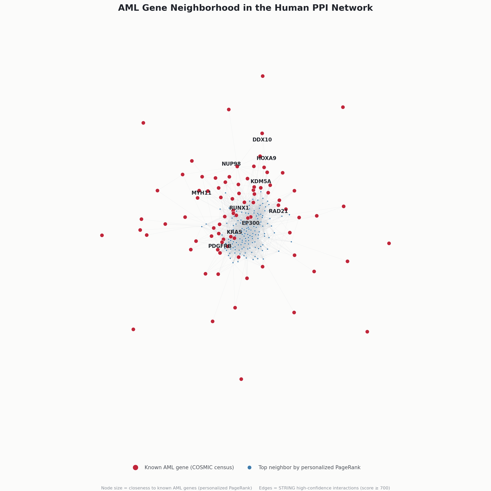

# PPI Cancer Prediction




The idea of this project emerged when I found out that my newly discovered
interest for networks could be combined with my rooted love for machine
learning and biology to try and approach existing problems with new solutions
and perspectives.

The core idea is: genes that interact heavily with known cancer genes
are themselves more likely to be relevant to that cancer. So instead of only
looking at a gene on its own, this project looks at where a gene sits inside
the human protein-protein interaction (PPI) network, and how close it is to
genes already known to be linked to AML (Acute Myeloid Leukemia). That
network position becomes a set of features for machine learning models to
learn from, first classical ones, and then a Graph Neural Network I built
from scratch to see if it could do even better.

## What's in the notebook

The notebook is one long walkthrough, from raw data to a trained model, and
it's split into 9 sections:

1. **Introduction** - the motivation behind the project.
2. **Data Exploration** - a first look at the three raw datasets: STRING
   protein aliases, STRING protein-protein interactions, and the COSMIC
   Cancer Gene Census.
3. **Data Preparation** - cleaning the data and mapping STRING protein IDs
   to actual gene symbols, so the interaction data and the cancer gene list
   can actually be joined together.
4. **Network Construction** - building the PPI network itself with
   `networkx`, around 19,000 genes and 6.7 million weighted interactions,
   and labeling which genes are known AML genes.
5. **Feature Engineering** - turning network structure into numeric columns
   a model can use: degree centrality, how many AML neighbors a gene has,
   how strong those connections are, and personalized PageRank (a multi-hop
   measure of how "reachable" a gene is from known AML genes through the
   whole network, not just its direct neighbors).
6. **Classical Machine Learning Models** - training and evaluating Logistic
   Regression, Random Forest, and XGBoost (baseline and hyperparameter
   tuned), plus a SHAP analysis to see which features the best model
   actually relies on.
7. **Model Comparison** - putting all four classical models side by side on
   ROC-AUC and PR-AUC.
8. **Graph Neural Network** - my first ever GNN, built from scratch in
   PyTorch with no graph deep learning library, explained in plain beginner
   terms along the way. It learns directly from the graph instead of from
   hand-engineered columns, and gets compared against the classical models.
9. **Conclusion** - a short, honest assessment of what worked, what didn't,
   and what I'd try next.

## Results

Since AML genes are rare (about 83 out of roughly 19,000 genes), accuracy
alone doesn't mean much here, so every model is judged mostly on PR-AUC
(precision-recall AUC), which handles class imbalance much better than
ROC-AUC does.

| Model | ROC-AUC | PR-AUC |
|---|---|---|
| Logistic Regression | 0.79 | 0.10 |
| Random Forest | 0.86 | 0.08 |
| XGBoost Baseline | 0.95 | 0.33 |
| XGBoost Tuned | 0.96 | 0.39 |
| GCN (from scratch) | 0.93 | 0.18 |

XGBoost Tuned is the best model overall, and the personalized PageRank
feature is what pushed it there, it roughly doubled XGBoost's PR-AUC on its
own compared to the same pipeline without it. The from-scratch GNN in
Section 8 didn't beat XGBoost, but it clearly beat both Logistic Regression
and Random Forest, and it actually found the most true AML genes of any
model (88% recall). More detail on all of this, including why, is in
Sections 7 through 9 of the notebook.

## Data

- [`9606.protein.aliases.v12.0.txt`](data/9606.protein.aliases.v12.0.txt) -> STRING protein ID to gene symbol aliases (human, taxon 9606)
- [`9606.protein.links.v12.0.txt.gz`](data/9606.protein.links.v12.0.txt.gz) ->  STRING protein-protein interaction edges with combined confidence scores
- [`Cosmic_CancerGeneCensus_v103_GRCh37.tsv`](data/Cosmic_CancerGeneCensus_v103_GRCh37.tsv) -> COSMIC Cancer Gene Census, used to label genes as AML-associated or not

Data files are not tracked in git. Download them from
[STRING](https://string-db.org/) and [COSMIC](https://cancer.sanger.ac.uk/census)
and place them under `data/`.

## Setup

```
python -m venv ppi-env
.\ppi-env\Scripts\Activate
pip install -r requirements.txt
```

`requirements.txt` includes everything needed for the whole notebook,
including PyTorch for the Graph Neural Network section, so this one install
step is all that's needed to run it end to end.
